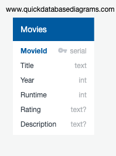

# Movie Search App

Sometimes people are unsure what movie they like to see, but a movie search website will provide an overview of the film.
This app allows them to get info regarding genres, director, actors, country, runtime, year release and brief description.

<p>&nbsp;</p>

### Languages, Frameworks and Application Platform:

- HTML5
- CSS
- Bootstrap v5.1
- Python 3.9.6
- Flask 2.0.2
- Jinja2 3.0.3
- Heroku


<p>&nbsp;</p>

### Deployed with Heroku:

[Welcome To Movie Search App](https://pegah-movie-app.herokuapp.com)

<p>&nbsp;</p>

**The Open Movie Database:**

    OMDb API: http://www.omdbapi.com

    The OMDb API is a RESTful web service to obtain movie information, all content and images on the site are contributed and maintained by our users.

Send all data requests to:

    http://www.omdbapi.com/?apikey=[yourkey]&

**Below is an example of results:**
    Search By Title: / Response:JSON

    Request:

    http://www.omdbapi.com/?t=mirage

    Response:

    {"Title":"Mirage","Year":"2018","Rated":"TV-MA","Released":"22 Mar 2019","Runtime":"128 min","Genre":"Drama, Fantasy, Mystery","Director":"Oriol Paulo","Writer":"Oriol Paulo, Lara Sendim","Actors":"Adriana Ugarte, Chino Darín, Javier Gutiérrez","Plot":"Two storms separated by 25 years. A woman murdered. A daughter missed. Only 72 hours to discover the truth.","Language":"Spanish","Country":"Spain","Awards":"2 nominations","Poster":"https://m.media-amazon.com/images/M/MV5BZWRhNGRhMTUtOTMwYS00YzE2LTk2YWQtMDU2MGQyYWNmMmU4XkEyXkFqcGdeQXVyMzY0MTE3NzU@._V1_SX300.jpg","Ratings":[{"Source":"Internet Movie Database","Value":"7.4/10"}],"Metascore":"N/A","imdbRating":"7.4","imdbVotes":"50,555","imdbID":"tt6908274","Type":"movie","DVD":"22 Mar 2019","BoxOffice":"N/A","Production":"N/A","Website":"N/A","Response":"True"}
<p>&nbsp;</p>

**Movies table:**

```
CREATE TABLE "Movies" (
    "MovieId" serial   NOT NULL,
    "Title" text   NOT NULL,
    "Year" int   NOT NULL,
    "Runtime" int   NOT NULL,
    "Rating" text   NOT NULL,
    "Description" text   NOT NULL,
    CONSTRAINT "pk_Movies" PRIMARY KEY (
        "MovieId"
     )
);
```
<p>&nbsp;</p>

